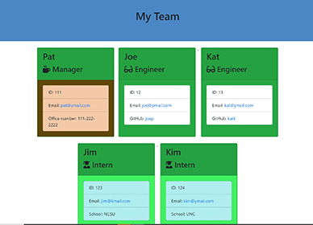

## Project Name: TeamProfileGenerator
## Title: My Team Profile

  

Table of Contents

<!-- vscode-markdown-toc -->
* 1. [Links to sample output of the application and repository:](#Linkstosampleoutputoftheapplicationandrepository)
* 2. [Introduction](#Introduction)
* 3. [Technologies](#Technologies)
* 4. [Features](#Features)
* 5. [Launch](#Launch)

<!-- vscode-markdown-toc-config
	numbering=true
	autoSave=true
	/vscode-markdown-toc-config -->
<!-- /vscode-markdown-toc -->

##  1. Links to sample output of the application and repository
* [Output of the Application](https://sskumar4.github.io/TeamProfileGenerator/output/team.html)
* [Repository](https://github.com/sskumar4/TeamProfileGenerator)

##  2. Introduction  
Build a Node CLI that takes in information about employees and generates an HTML webpage that displays summaries for each person. The application will prompt the user for information about the team manager and information about the team members. The user can input any number of team members, and they may be a mix of engineers and interns. This application also passes all unit tests. When the user has completed building the team, the application will create an HTML file that displays a formatted team roster based on the information provided by the user.

##  3. Technologies 
HTML, Bootstrap, Javascript 

##  4. Features
Files
HTML: main.html, engineer.html, intern.html, manager.html, teamhtml, 
Javascript: app.js, Employee.js, Engineer.js, htmlRenderer.js, Intern.js, Manager.js

Developed the application with the following features:
  * Created a parent class `Employee` with the following properties (name, id
  * email and methods (getName(), getId(), getEmail(), getRole())
  * Three other classes: `Manager`, `Engineer`, `Intern`extend `Employee` class.
  * In addition to `Employee`'s properties and methods, `Engineer` also includes:
    github (GitHub username), getGithub(), getRole() 
  * In addition to `Employee`'s properties and methods, `Intern` also includes:
    school, getSchool(), getRole()
  * In addition to `Employee`'s properties and methods, `Intern` also includes:
    school, getSchool(), getRole() 
  * The project prompts the user to build an engineering team. The engineering
    team consists of a manager, and any number of engineers and interns.
  * The project generates a `team.html` page in the `output` directory, that displays a  formatted team roster. Each team member should display the following in no particular order: Name, Role, ID, Role-specific property (School, link to GitHub profile, for Intern role and office number for Manager role)
  * Used validation to ensure that the information provided is in the proper expected format.
  * Added the application to the portfolio.

##  5. Launch
Inquirer package should be installed for this app to run. To launch the application :

* Clone this repository
* Issue npm i ain the local repository root, so that all dependencies (inquirer package) are installed
* Launch node app.js and answer all questions
* Team.html will be generated at the ./output directory

